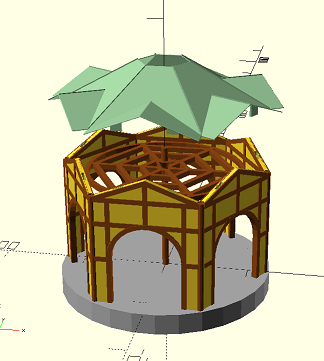

# openscad-carousel

Please note that this is **WORK IN PROGRESS**! Model may change extensively without any backward parts compatibility!

This tiny repo consists of [OpenSCAD](https://openscad.org) scripts that can generate a 3D model of a rotating carousel.

Intent is to have a core model for 3D printing, that allows to add any custom separately created "seats" into the rotating rig space of carousel.

It should be easy to customize resulting model (e.g. total size, height, number of walls/faces of the carousel N-gon, etc.) using the "configuration" constants in the script code.

# work in progress preview

# Customizing model

You can use file [carousel/config.scad](carousel/config.scad) to modify some features of the carousel, like total dimensions, number of walls making the whole N-gon shell, etc. See file contents and comments for details.

There are lot of relationships and constraints between various parts of carousel. When changing config to your needs, you may observe some parts breaking apart or not interconnecting properly. Despite math in the model being not that complex, i may have missed (and most probably did on several occasions)  correct bindings due to whole scope of model. In case the carousel breaks for your required config, you can let me know...

# 3D printing

See [carousel/bom.scad](carousel/bom.scad) file for details on how many pieces and which modules need to be printed.

Don't forget to raise `$fn` variable (line at the beginning of the bom script) before generating any model parts - for smoother rounded surfaces, columns, etc. Your ideal number may vary - higher number may cause OpenSCAD to take longer to generate a model.

# Mounting example

See [mounting-example.scad](mounting-example.scad) file for a simple example on how to easily attach own module/object into carousel for testing/visualization purposes.

# TODO

- fix helpers/lance mounts to allow mounting models also to mid-sections, not only ring rib arms
- finalize, humanize, clean-up the all modules
